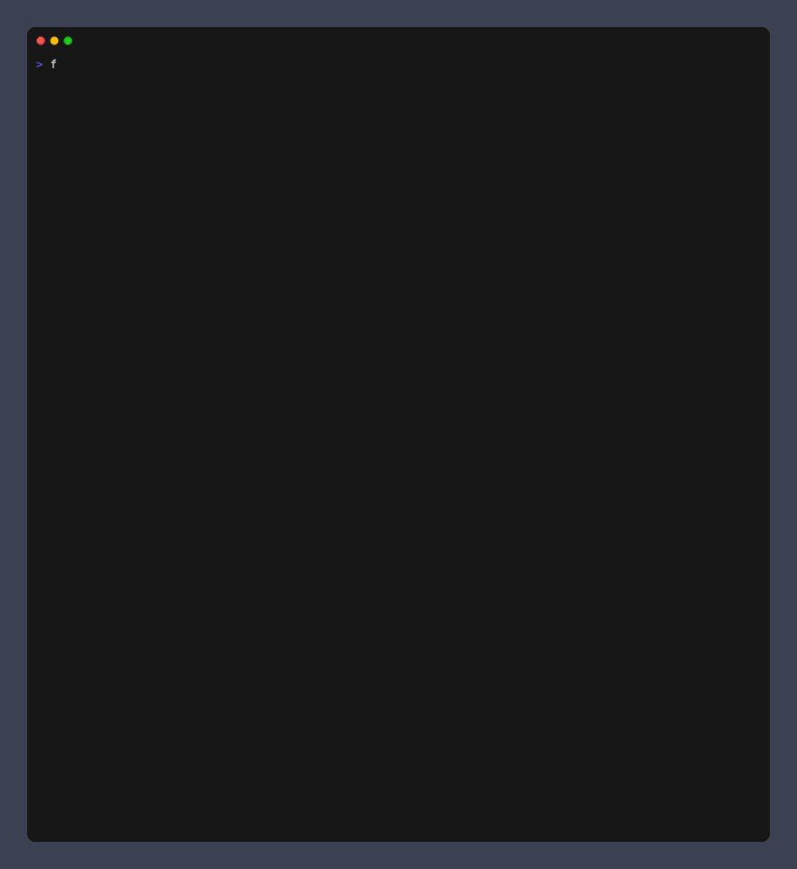

> [!WARNING]
> This is a personal project and is not affiliated with F1 in any way

# F1 CLI

_Formula 1 in your terminal_



## Download

Download the [release binary](https://github.com/bcdxn/f1cli/releases) appropriate for your system and ensure it's available on your path.

## Running F1 CLI

Once you've added F1 CLI to your path, in your terminal emulator of choice, simply run:

```
f1
```

> [!INFO]
> There must be an active F1 session

## Suggested Terminal Settings

F1 CLI relies on lipgloss for styling; it will look best with certain fonts. F1 CLI is tested using
the font 'Menlo' with a font size of 12, which will likely give the best results in terms of alignment and overall styling.

## Local Dev

#### Test

```
go test ./...
```

#### Run

```
go run cmd/tui/main.go
```

#### Validate Goreleaser

```
goreleaser release --snapshot --clean
```